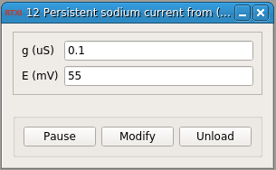

### (Wang, 1993) Persistent sodium current

Developed by Rodrigo Amaducci (rodrigo.amaducci@uam.es)

Grupo de Neurocomputación Biológica (GNB), Universidad Autónoma de Madrid

**Requirements:** None  
**Limitations:** None  

<!--start-->

<b>Persistent sodium current from (Wang, 1993) neuron model.

<!--end-->

#### Input
1. input(0) - v (mV) : Membrane voltage

#### Output
1. output(0) - I (nA) : Ionic current

#### Parameters
1. g (uS) - Conductance
2. E (mV) - Reversion potential

#### States
